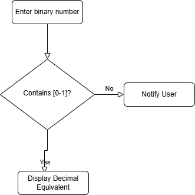

# Binary-2-Decimal-Convertor

Binary is the number system all digital computers are based on. Therefore it's important for developers to understand binary, or base 2, mathematics. The purpose of Bin2Dec is to provide practice and understanding of how binary calculations.

Bin2Dec allows the user to enter strings of up to 8 binary digits, 0's and 1's, in any sequence and then displays its decimal equivalent.

This challenge requires that the developer implementing it follow these constraints:

- Arrays may not be used to contain the binary digits entered by the user
- Determining the decimal equivalent of a particular binary digit in the sequence must be calculated using a single mathematical function, for example the natural logarithm. It's up to you to figure out which function to use.

## User Stories
- User can enter a variable number of binary digits
- User must be notified if anything other than a 0 or 1 was entered
- User views the results in a single output field containing the decimal (base 10) equivalent of the binary number that was entered

## Design



## System Architecture
This a monolithic application that is built using the following technologies:
- Java 21
- JavaFX
- Maven
- JUnit 5
- Mockito
- Log4j
- JavaFX Scene Builder
- JavaFX CSS
- JavaFX FXML

## Features

The Binary-to-Decimal Converter application provides the following features:

- **User-Friendly Interface**: Clean and intuitive JavaFX interface for easy interaction
- **Input Validation**: Real-time validation ensuring only valid binary numbers (0s and 1s) are accepted
- **Error Handling**: Clear error messages when invalid input is detected
- **Conversion Logic**: Converts binary numbers to their decimal equivalents using both:
  - Java's built-in `Integer.parseInt()` method
  - A custom mathematical implementation using powers of 2
- **Comprehensive Logging**: Detailed logging using Log4j for debugging and auditing
- **Responsive Design**: Adapts to different window sizes
- **Keyboard Shortcuts**: Support for keyboard navigation and shortcuts

## Building and Running the Application

### Prerequisites

- Java Development Kit (JDK) 21 or later
- Maven 3.6+ (optional, as the project includes Maven Wrapper)

### Building the Project

#### Using Maven Wrapper (Recommended)

The project includes a Maven Wrapper, which allows you to build the project without installing Maven.

```powershell
# On Windows
.\mvnw.cmd clean package

# On macOS/Linux
./mvnw clean package
```

#### Using Maven (if installed)

```powershell
mvn clean package
```

### Running the Application

```powershell
# Using Maven Wrapper on Windows
.\mvnw.cmd javafx:run

# Using Maven Wrapper on macOS/Linux
./mvnw javafx:run

# Using Maven directly
mvn javafx:run
```

### Running Tests

```powershell
# Using Maven Wrapper on Windows
.\mvnw.cmd test

# Using Maven directly
mvn test
```

For more detailed build and run instructions, please see the [BUILD.md](BUILD.md) file.

## Contributing

### Issue Reporting

1. Navigate to the [Issues](https://github.com/msjackiebrown/binary-2-decimal-convertor/issues) tab of the repository
2. Click on "New Issue"
3. Select either "Bug Report" or "Feature Request" template
4. Fill in the required information and submit the issue

### Feature Requests and Bug Reports

If you have suggestions for new features or encounter bugs while using the application, please create an issue with the following information:

- For bugs: Include steps to reproduce, expected behavior, and actual behavior
- For feature requests: Include a clear description of the proposed feature and why it would be valuable

### Pull Requests

If you'd like to contribute code to the project:

1. Fork the repository
2. Create a new branch for your feature or bug fix
3. Implement your changes
4. Add tests for your changes if applicable
5. Make sure all tests pass
6. Submit a pull request

## License

This project is licensed under the MIT License - see the [LICENSE](LICENSE) file for details.


